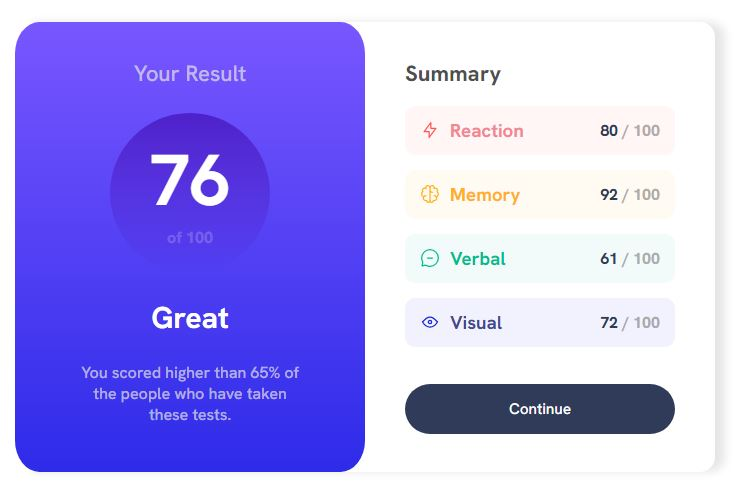
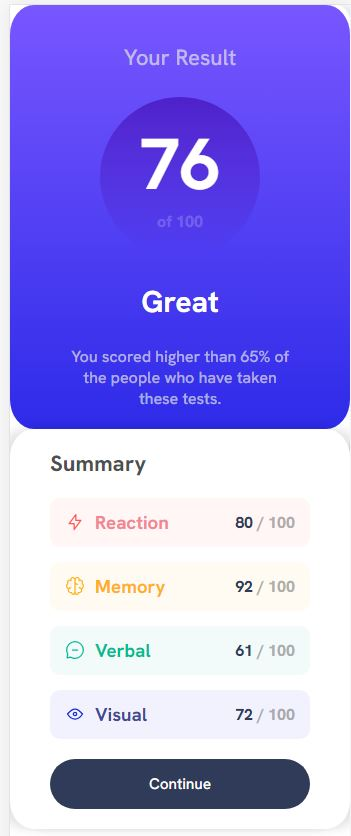

# Frontend Mentor - Results summary component solution

This is a solution to the [Results summary component challenge on Frontend Mentor](https://www.frontendmentor.io/challenges/results-summary-component-CE_K6s0maV). 

## Table of contents

- [Overview](#overview)
  - [The challenge](#the-challenge)
  - [Screenshot](#screenshot)
  - [Links](#links)
- [My process](#my-process)
  - [Built with](#built-with)
- [Author](#author)

## Overview

### The challenge

Build a responsive results summary component that resembles the provided design.

### Screenshot

### Links

- Solution URL: [GitHub](https://github.com/lucasmendeslms/results_summary_component)
- Live Site URL: [Results Summary Component](https://lucasmendeslms.github.io/results_summary_component/)

### Built with

- Semantic HTML5 markup
- CSS custom properties
- Flexbox
- CSS Grid
- Mobile-first workflow

## Author

- Frontend Mentor - [@lucasmendeslms](https://www.frontendmentor.io/profile/lucasmendeslms)